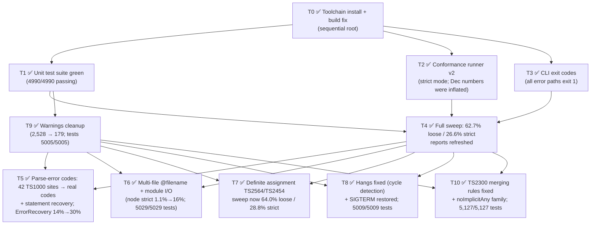

# Task DAG — Toolchain Modernization & Conformance Push

_Last updated: 2026-07-23. Statuses: ✅ done · 🔄 in progress (agent) · ⏳ blocked/pending._

Project was dormant since Dec 28, 2025. The MoonBit toolchain moved to
moon 0.1.20260713 / moonc v0.10.4 with breaking changes (string indexing
returns `UInt16`, `moonbitlang/async` 0.14.2 → 0.20.3 removed
`BufferedReader`, build output moved `target/` → `_build/`).

## DAG

## Wave 0 — sequential root ✅

| ID | Task | Status | Notes |
|----|------|--------|-------|
| T0a | Install latest MoonBit toolchain | ✅ | moon 0.1.20260713, moonc v0.10.4 (July 2026) |
| T0b | Upgrade `moonbitlang/async` 0.14.2 → 0.20.3 | ✅ | `src/moonbit/moon.mod.json` |
| T0c | UInt16/Int string-indexing migration | ✅ | transformer.mbt, config/{glob,path_resolver,tsconfig,project_references}.mbt, cli/output.mbt |
| T0d | async 0.20.3 API migration | ✅ | `BufferedReader` → `Reader::read_until("\n")` in coordinator/worker_pool.mbt, worker/worker.mbt |
| T0e | `moon build --target native` green | ✅ | 0 errors, ~50 warnings remain (T9) |

## Wave 1 — parallel (independent, running now)

| ID | Task | Depends on | Files touched | Agent |
|----|------|-----------|---------------|-------|
| T1 | Make `moon test --target native` fully green — fix remaining UInt16/async migration fallout in test + source files | T0 | ✅ Done: 74 compile errors were all the new `assert_eq` `Debug`-trait requirement; added `Debug` to 28 `derive` lists (types_v2.mbt + 6 other files). **4990/4990 tests pass**, zero behavioral failures. | ✅ |
| T2 | Conformance runner v2: repo-relative/env-var paths (currently hardcoded to another machine), strict mode comparing TSxxxx error codes against baseline `.errors.txt`, category-sweep mode | T0 | ✅ Done: rewritten runner (`TSC_CLI`/`TS_REPO` env vars, `--strict`, `--all`, crash/directive buckets), TS repo cloned to `../typescript-repo`, docs at `docs/CONFORMANCE_RUNNER.md`. **Dec 2025 numbers were inflated by a variant-baseline bug**: computedProperties is actually 108/142 loose (76.1%, not 142/142) and 59/142 strict (41.5%); templates 96.1% loose / 85.4% strict. Recurring gaps: generic `TS1000` instead of specific parse codes; missing `TS7006`/`TS7010` (noImplicitAny); `TS5107` variant policy. | ✅ |
| T3 | CLI exit-code regression: `cli.exe file.ts --noEmit` prints `1 error(s)` but exits 0 | T0 | ✅ Done: c0f0bda's `exit(1)` missed several paths — `--json` compile mode, `--project --json` with type errors, `--build`, no-files-found, `--list-imports` parse failures. Centralized in new `cli/exit_code.mbt` (`compute_exit_code`), 10 whitebox tests in `exit_code_wbtest.mbt`. Convention: exit 1 on any error, 0 clean. All paths verified against the rebuilt binary; suite 5000/5000. (The originally observed `--noEmit` exit-0 was a stale-binary artifact; the JSON paths were the real holes.) | ✅ |

## Wave 2 — sequential barrier

| ID | Task | Depends on | Notes |
|----|------|-----------|-------|
| T4 | Full conformance sweep in strict mode; refresh `src/moonbit/CONFORMANCE_REPORT.md` and `docs/FEATURE_GAP_ANALYSIS.md` with real 2026 numbers | T1 + T2 + T3 | ✅ Done (July 23, 2026, all 5,693 tests, 52 categories): **loose 3,569/5,693 = 62.7%; strict 1,517/5,693 = 26.6%**. Top extra code: generic `TS1000` (1,118 tests). Top missing: `TS5107` (874, mostly variant-baseline policy), `TS2564` (312), `TS2322` (271), `TS2304` (271), `TS2454` (228). 2,358 strict failures involve unhonored directives (mostly `@filename` multi-file). 4 tests hang the checker forever (generic rest params / variadic tuples) and the CLI ignores SIGTERM — counted as crashes via SIGKILL watchdog. Both reports updated; December content preserved as historical. |
| T9 | Deprecation warnings cleanup (`derive(Show)`→`derive(Debug)`, `not(x)`→`!x`, StringView `to_owned`, …) | T1 | ✅ Done: **2,528 → 179 warnings**; build 0 errors, tests 5005/5005 (5 new utils tests). Migrated ~895 `not()`, 378 derives, 247 collection constructors, 25 functional `loop` expressions, keyword renames, pkg imports. Remaining 179 are non-mechanical: 138 never-constructed enum variants (reserved diagnostic codes — product decision), 34 unused private functions, and two flagged smells: `cli/output.mbt` base64 encodes UTF-16LE not UTF-8 for inline source maps, and dead code at `compiler/parser.mbt:4972` in a `KeywordStatic` arm (→ T5 to investigate). |

## Wave 3 — parallel feature gaps (re-ranked by T4's measured strict-mode impact)

The original wave-3 list (JSX, ambient, advanced types) was based on the inflated December numbers; T4's frequency tables replaced it. All of these touch compiler source, so they waited on T9. Because HEAD doesn't contain the (uncommitted) migration work, worktrees would not build — so wave 3 runs in the main tree, split into two sub-waves with file-disjoint scopes: **3a** = T5 (parser) ∥ T6 (runner + module resolution) ∥ T8 (checker generics + cli signals); **3b** = T7 and T10 afterwards (both live in core checker paths T8 is touching). ⚠️ Consider committing a checkpoint before/after wave 3a — the tree carries a lot of uncommitted multi-agent work.

| ID | Task | Depends on | Measured impact |
|----|------|-----------|-----------------|
| T5 | Parse-error code specificity: stop emitting generic `TS1000`, emit real codes (`TS1005`, `TS1109`, `TS1128`, …) | T4 + T9 | ✅ Done. 42 TS1000 call sites converted across parser.mbt/parser_type.mbt/parser_expression.mbt/parser_v2_expression.mbt/parser_utils.mbt via new DRY `add_error_code` helper (TS1003/1005/1009/1109/1110/1128/1135/1141/1206/1472). New tsc-style recovery: skip-and-continue for bad statement tokens (fixes silent file truncation after stray tokens), argument-list recovery, trailing commas in calls, definite-assignment assertion `x!: T` now parses. Strict: parser/ErrorRecovery 13/92→28/92; computedProperties →62/142; templates extras now correct codes (remaining failures are checker-side). Also fixed the parser.mbt:4972 dead code — it masked a real bug where `static` members with keyword names were silently dropped, derailing brace matching. 23 new unit tests; suite **5054/5054**. Left as TS1000: depth-guard, meta-properties, JSX/JSON fallbacks. |
| T6 | Multi-file test support: honor `@filename` directives (runner-side synthesis or compiler multi-file input) + module resolution real file I/O (node_modules, `.d.ts`, `@types`) | T4 + T9 | ✅ Done. Runner splits `@filename` tests into real per-test temp files (mirrors TS harness `makeUnitsFromTest`) and compiles all units together. Compiler: `file_exists` stub replaced with file-set-backed resolution (exact/extension-substitution/index), new `validate_multi_file_imports` (TS2305/2306/2724/1192, filesystem-checked TS2307), cross-file type registry resolution fixed in checker, `export namespace` recognized. New `cli/cross_file.mbt`, 20 unit tests, suite **5029/5029**. Strict: node 1→15/94, moduleResolution 1→4/51, externalModules 29→31 with DirFail 173→109 (failures now honest checker mismatches, not directive skips; small loose declines were accidental garbage-parse passes, all diffed and explained). |
| T7 | Definite assignment analysis: `TS2564` (strictPropertyInitialization, 312 missing) + `TS2454` (used before assigned, 228 missing) | T4 + T9 | ✅ Done. Key insight: TS baselines are generated with strict ON by default, so both diagnostics default on, disabled via `@strict: false` / per-flag directives (new tri-state `CompilerDirectives` fields). TS2564 with constructor-assignment collection; TS2454 with branch-join, shadowing, nested-function exemptions; `declare` class-member modifier now parsed (was a TS2564 FP source). Deliberately conservative to avoid false positives — none found in probes. 33 new unit tests; suite **5,086/5,086**. **Full sweep after wave 3: loose 3,644/5,693 = 64.0% (was 62.7%), strict 1,640/5,693 = 28.8% (was 26.6%)** — includes T5/T6 contributions; no compared category regressed. |
| T8 | Crash fixes: checker infinite loops on `genericRestParameters1`, `restTuplesFromContextualTypes`, `variadicTuples1/2`; make CLI respond to SIGTERM | T4 + T9 | ✅ Done. All 4 hangs were one bug: infinite tail-recursion in `extract_iterable_element_type` (checker.mbt) — type params are cached self-referentially, and a spread of a generic type param (`f10(...u)`) looped forever under native TCO. Fixed with real cycle detection (visited-set) + fallback to the type-parameter constraint. SIGTERM: async runtime masks signals process-wide (`pthread_sigmask`) for cooperative cancellation; CLI now calls `@signal.set_global_cancellation_signals([])` at startup so SIGTERM/SIGINT terminate (exit 143 / `timeout` works). All 4 tests now finish in ≤5ms with diagnostics. Tests: **5009/5009** (4 new: cycle whitebox + e2e repro). |
| T10 | Diagnostic precision: `TS2300` duplicate-identifier over-reporting (283 extra) + noImplicitAny family `TS7006`/`TS7010`/`TS7008`/`TS7031` (~100 missing) | T4 + T9 | ✅ Done. TS2300: binder merge whitelist extended to tsc rules (class+interface/namespace, type-alias+value, imports→TS2440 territory, default exports, object-literal dupes→TS1117); extra-TS2300 in worst categories: externalModules 23→2, internalModules 18→2. noImplicitAny: `no_implicit_any` directive (default on under strict, off for .js), TS7006/7008/7010/7013/7019/7031/7005 implemented matching tsc baselines; contextual callbacks verified not flagged. 41 unit tests added/rewritten (old TS2300 test had tautological asserts); suite **5,127/5,127**. Final sweep: **strict 28.9%, loose 64.0%** — per-category strict gains: parser 205→237, types 181→201, classes 77→91, internalModules 15→25, externalModules 29→37. Deferred: TS7006 for arrows (needs contextual typing), flow-sensitive TS7005/7034, private accessor parsing. |

## Wave 4 — measurement honesty + deprecation parity

| ID | Task | Depends on | Status |
|----|------|-----------|--------|
| T11 | Strict variant-baseline policy + TS5107 deprecated-option errors. (a) Runner: strict mode compares against the variant baseline matching the config actually run (first `@target`/`@module` value, es6→es2015 normalized) instead of the union of all variants; falls back to union only for variants keyed on unhonored options; honors `@ignoreDeprecations`. (b) CLI: emits tsc 6.x `TS5107` for explicitly passed deprecated values (`--target es3/es5`, `--module amd/umd/system/none`), suppressed by new `--ignoreDeprecations` flag, exit 1. TS5107 was the #1 missing code (874 tests; `target=ES5` appears in 2,648 baselines). 12 new cli unit tests. Spot check: es6/computedProperties strict **62/142 → 121/142 (85.2%)**, templates unchanged. Full sweep: **loose 3,994/5,693 = 70.2% (was 64.0%); strict 1,999/5,693 = 35.1% (was 28.9%)**; crash bucket 8→4. | wave 3 | ✅ |

## Wave 4b — parallel ✅ (full sweep after: **loose 70.6%, strict 35.7%**; suite 5,203/5,203)

| ID | Task | Depends on | Status |
|----|------|-----------|--------|
| T12 | Bisect + fix the ambient strict regression (−4: extra TS2390/2391/2339, introduced by commit 2f2a7a3) | T11 | ✅ Done. Plot twist: no flipped condition — every 2f2a7a3 hunk at the emission sites was mechanical. The regression was **never-implemented ambient-context propagation**, previously masked by pre-T6 measurement (shorthand tests passed only because module+import compiled as one unit). Implemented properly: `declare namespace` carries Declare modifier; `in_ambient_context` flags in binder+checker; DRY `is_effectively_ambient` helper gates TS2390/2391/1155/1182/7005; ambient namespace members implicitly exported (fixes TS2339); TS2710 requires actual declarations. 13 new tests; suite **5,168/5,168**. ambient strict 7→11/22 (=July baseline), loose 14/22 (July was 12); canaries held. |
| T13 | Type-only import/export semantics: TS1361/1362/1363/1369 (largest remaining externalModules bucket, B3) | T11 | ✅ Done. TS1361 (type-only import used as value — identifiers, shorthand, property-access bases, `extends`), TS1362 cross-file via new `TypeOnlyAliasFlavor` propagated through export chains/star re-exports with value-merge cancellation, TS1363, TS2206/2207. Parser: `import type from`, `type as as bar` disambiguation, `export type * as ns from`. Emit elision of type-only imports (ESM+CJS). DAG ordering for `export…from` re-exports; star re-export expansion killed spurious TS2305s. (TS1369 verified as related-info only — correctly skipped.) 30 new tests; suite **5,203/5,203**. externalModules strict **→82/227** (was 37 pre-wave-4b). Deferred: importsNotUsedAsValues/verbatimModuleSyntax flag semantics. |
| T14 | package.json / node_modules resolution: `main`/`types`/`exports`, `@types` lookup (B1) | T11 | ✅ Done. node10-order resolution: package-then-`@types` per directory level walking up, scoped-name mangling (`@scope/pkg`→`scope__pkg`), package.json `types`/`main` with extension substitution and nested-redirect subpaths; ambient `declare module` matching incl. `*` wildcards across compiled files; checker's unconditional TS2307 suppressed via CLI cross-file validation; **TS7016** for untyped `.js` under noImplicitAny (new `@allowJs` directive suppresses); TS1155/.d.ts-ambient fix (B2 partial). Also fixed a latent async `&&` non-short-circuit crash. 18 new unit tests; suite **5,171/5,171**. moduleResolution strict **4→15/51**; node 15→16/94 (one accidental pass honestly lost to a nodenext gap); canary held. Deferred: `exports` conditions, node16/nodenext, typesVersions, self-names. |
| T15 | Core diagnostic parity survey: classify ~50 sampled failures missing TS2322/TS2304/TS2339 into scoped implementation tasks (read-only) | T11 | ✅ Produced the ranked wave-5 list below. Also confirmed what already works (primitive assignability, interface member checks, TS2551 property suggestions, generic-constraint property access) so wave 5 doesn't re-touch it. |

## Wave 5 — core diagnostic parity (from T15's survey; 5a ✅ + 5b ✅ done — full sweep after 5b: **loose 71.1%, strict 36.5%, crashes 3**; T21 remaining)

| ID | Task | Size | Unlocks | Entry point |
|----|------|------|---------|-------------|
| T16 ✅ | TS2304 for unresolved type-reference names in type position | S/M | ✅ Done. Emission at the `get_type_from_type_node` fallback (single funnel for annotation positions) with per-location dedup; new `is_known_lib_type_name` stdlib whitelist; new `unresolved_type_names.mbt` full-AST declared-name collector suppressing false positives (trades out-of-scope-type-param detection for zero extras); TS2304 suppressed on parse-error files. Also fixed parser bug: `{ foo; }` type-literal shorthand desugared to `foo: foo` causing bogus type lookups (now `foo: any`). types strict 201→**207**/842, classes flat, **zero new extra TS2304s**; 17 new tests; suite 5,220/5,220. Deferred: secondary `resolve_type_reference` fallback (no source loc), TS2749 for value-as-type. | `checker.mbt` + `unresolved_type_names.mbt` |
| T17 ✅ | TS2339 property access on union & intersection | M | ✅ Done. Union: property must exist on every constituent (tsc-matching two-part message), private/protected members dropped from unions (TS2339); intersection: missing-from-all. Conservative `type_members_fully_known` gate (skips primitives/index-signatures/heritage-clause types) → **zero new extra TS2339s**. Prerequisite work: discriminant narrowing (`obj.prop === literal`, switch-case) now feeds property access, and fixed a pre-existing bug where narrowing save/restore was a no-op (shared-map mutation → copy-on-write), so narrowing correctly ends at branch boundaries. types strict 201→**213**/842 combined with T16/T19. 17 new tests; suite 5,237/5,237. Deferred: intersection never-reduction, tuple indexed access, optional-chaining `?.` path, intersection-of-property-types result rule (documented deviation). | `checker.mbt` |
| T18 ✅ | Class-body methods as call signatures in structural assignability | M | ✅ Done. `resolve_class_to_object_type` now contributes methods/accessors/inherited members (was properties-only); new `is_method` flag on PropertySignature (39 sites); tsc method bivariance (`is_method_signature_assignable` — strictFunctionTypes still strict for property-syntax functions); **coinductive recursion guard fixed a pre-existing segfault** on mutually recursive class comparisons (`class C { p: C }` vs `class E { p: E }` — was crash exit 139, incl. baseline crash in assignmentCompatWithObjectMembers). classes strict 107→**110**/466, types crash 1→0, zero new extras. 15 new tests; suite **5,279/5,279**. Scoped out: generic class instantiation in relation (derivedClassTransitivity3), private nominal comparison (no in-reach test needs it), abstract constructor-side. | `checker.mbt` |
| T19 ✅ | Assignability grab-bag: strictNullChecks undefined/null exclusion; enum assignability rules; wrapper-object→primitive rejection | M | ✅ Done (validated on an isolated build: types +18 → 219/842, expressions +7 → 92/376, **zero new failures**, attributable to T19 alone). Wrapper types now real `TypeReference`s with tsc member-hiding semantics (TS2322/TS2696); new `enum_registry.mbt` gives nominal enum rules (number→E ok, F↛E, literal→E only on member-value match); strict-null exclusion gated on `effective_strict_flags` with optional-param/prop tolerance and non-null-assertion stripping. Bonus fixes: namespace var-hoisting boundary (TS2403 FP), TS2352 suspicious assertions, trailing-dot numeric literals, `-1` literal typing. 26 new tests; suite **5,264/5,264**. Deferred: spread property-union inference, per-member enum literal types (chose honest approximation over accidental passes), TS18047-49. | `checker.mbt`, `enum_registry.mbt` |
| T20 ✅ | Tuple & array-literal contextual assignability | M/L | ✅ Done, verified per-line against tsc 7.0.2 on repro batteries. Relation arms: array→tuple (only when no required elements + rest), tuple→tuple (arity/optional/rest rules with tsc messages); array literals contextually typed against tuples (spread splicing, nested elements, return positions via new contextual-return plumbing, call args); single non-generic signatures now emit TS2345/TS2554 instead of blanket TS2769. Also removed pre-existing false positives (spread-of-tuple TS2548, optional-element cases). types strict →**226**/842 with crash→0 (the T18-fixed segfault test now fails gracefully), es6 642→**647**/1045. 40 new tests; suite **5,319/5,319**. Deferred: readonly tuples (parser drops `readonly`), generic tuple-constraint inference, `as const`. | `checker.mbt`, `type_convert.mbt` |
| T21 | Generic call/construct-signature assignability (deep variance) | L | ~10–15 tests | `generics.mbt` + relate — schedule last |

Deferred by the survey as needing their own scoping: template-literal-type pattern matcher (~9), `this`-type/private-name TS2339 cluster (~15), strict-mode `eval`/`arguments` TS2304 sub-bucket, mapped/conditional-type-driven TS2322 (symptom, not root).

## Backlog — follow-ups surfaced by T6 (wave 4+ candidates, unscheduled)

| ID | Task | Notes |
|----|------|-------|
| B1 | node_modules / package.json resolution (`main`/`types`/`exports`), `@types` lookup | Bare specifiers still emit unconditional TS2307 (checker.mbt ~line 20799) even when an ambient module or on-disk package exists |
| B2 | Ambient `declare module "x"` across real files; TS1155 false positive for uninitialized `const` in declare-module blocks in `.d.ts` | |
| B3 | typeOnly import/export semantics (TS1361/1362/1363/1369) | Largest remaining externalModules loose bucket |
| B4 | NodeNext/node16 rules: TS2835 extensionless ESM imports, `.mts`/`.cts`, module=node18/20; bundler/customConditions/typesVersions | |
| B5 | Untyped `.js` relative import under noImplicitAny → TS7016 (currently silent) | Overlaps T10's noImplicitAny work |
| B6 | Wire cross-file validation into `run_json_compile`/project/watch modes (only `run_single_compile` has it) | Watch mode recompiles subsets — needs care |
| B7 | Runner: honor `@currentDirectory`, `@noImplicitReferences`, `@traceResolution` directives (`@strict` family now honored compiler-side via T7) | |
| B8 | Parser: `p!: T` definite-assignment assertion on class properties silently loses the type annotation and produces a stray member | Flagged by T7; TS2564 stays safe (unannotated props skipped) but it's a real parser gap |
| B9 | Wire `CompileOptions.strict*` CLI/tsconfig flags to the checker (currently dead; file directives are the only control surface) | Flagged by T7 |
| B10 | TS7006 for function expressions/arrows (needs contextual-typing info at parameter-check time); flow-sensitive TS7005/TS7034 | Deferred by T10 |
| B11 | Private accessors `set #x(v)` parse as methods (2 esDecorators strict tests); `{ new (); }` type-literal parse gap; TS7008/TS7006 inside type literals | Deferred by T10 |
| B12 | ambient category strict −4 vs July report (extras TS2390/2391/2339) — introduced by the committed toolchain-migration changes, not wave 3; needs bisect | Flagged by T10's final sweep |

## Conventions

- Build: `moon build --target native` from `src/moonbit/` (toolchain: `export PATH="$HOME/.moon/bin:$PATH"`).
- Binary now lands at `src/moonbit/_build/native/debug/build/cli/cli.exe`.
- Every change ships with unit tests (CLAUDE.md).
- Issue tracking normally via `bd` (beads), but `bd` is not installed on this machine — this file is the tracking source until then.
