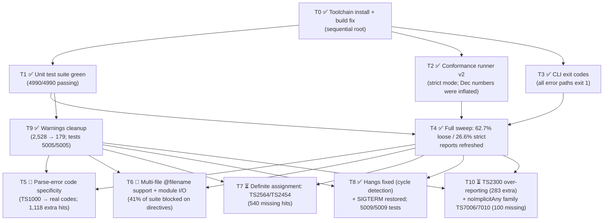

# Task DAG — Toolchain Modernization & Conformance Push

_Last updated: 2026-07-23. Statuses: ✅ done · 🔄 in progress (agent) · ⏳ blocked/pending._

Project was dormant since Dec 28, 2025. The MoonBit toolchain moved to
moon 0.1.20260713 / moonc v0.10.4 with breaking changes (string indexing
returns `UInt16`, `moonbitlang/async` 0.14.2 → 0.20.3 removed
`BufferedReader`, build output moved `target/` → `_build/`).

## DAG

## Wave 0 — sequential root ✅

| ID | Task | Status | Notes |
|----|------|--------|-------|
| T0a | Install latest MoonBit toolchain | ✅ | moon 0.1.20260713, moonc v0.10.4 (July 2026) |
| T0b | Upgrade `moonbitlang/async` 0.14.2 → 0.20.3 | ✅ | `src/moonbit/moon.mod.json` |
| T0c | UInt16/Int string-indexing migration | ✅ | transformer.mbt, config/{glob,path_resolver,tsconfig,project_references}.mbt, cli/output.mbt |
| T0d | async 0.20.3 API migration | ✅ | `BufferedReader` → `Reader::read_until("\n")` in coordinator/worker_pool.mbt, worker/worker.mbt |
| T0e | `moon build --target native` green | ✅ | 0 errors, ~50 warnings remain (T9) |

## Wave 1 — parallel (independent, running now)

| ID | Task | Depends on | Files touched | Agent |
|----|------|-----------|---------------|-------|
| T1 | Make `moon test --target native` fully green — fix remaining UInt16/async migration fallout in test + source files | T0 | ✅ Done: 74 compile errors were all the new `assert_eq` `Debug`-trait requirement; added `Debug` to 28 `derive` lists (types_v2.mbt + 6 other files). **4990/4990 tests pass**, zero behavioral failures. | ✅ |
| T2 | Conformance runner v2: repo-relative/env-var paths (currently hardcoded to another machine), strict mode comparing TSxxxx error codes against baseline `.errors.txt`, category-sweep mode | T0 | ✅ Done: rewritten runner (`TSC_CLI`/`TS_REPO` env vars, `--strict`, `--all`, crash/directive buckets), TS repo cloned to `../typescript-repo`, docs at `docs/CONFORMANCE_RUNNER.md`. **Dec 2025 numbers were inflated by a variant-baseline bug**: computedProperties is actually 108/142 loose (76.1%, not 142/142) and 59/142 strict (41.5%); templates 96.1% loose / 85.4% strict. Recurring gaps: generic `TS1000` instead of specific parse codes; missing `TS7006`/`TS7010` (noImplicitAny); `TS5107` variant policy. | ✅ |
| T3 | CLI exit-code regression: `cli.exe file.ts --noEmit` prints `1 error(s)` but exits 0 | T0 | ✅ Done: c0f0bda's `exit(1)` missed several paths — `--json` compile mode, `--project --json` with type errors, `--build`, no-files-found, `--list-imports` parse failures. Centralized in new `cli/exit_code.mbt` (`compute_exit_code`), 10 whitebox tests in `exit_code_wbtest.mbt`. Convention: exit 1 on any error, 0 clean. All paths verified against the rebuilt binary; suite 5000/5000. (The originally observed `--noEmit` exit-0 was a stale-binary artifact; the JSON paths were the real holes.) | ✅ |

## Wave 2 — sequential barrier

| ID | Task | Depends on | Notes |
|----|------|-----------|-------|
| T4 | Full conformance sweep in strict mode; refresh `src/moonbit/CONFORMANCE_REPORT.md` and `docs/FEATURE_GAP_ANALYSIS.md` with real 2026 numbers | T1 + T2 + T3 | ✅ Done (July 23, 2026, all 5,693 tests, 52 categories): **loose 3,569/5,693 = 62.7%; strict 1,517/5,693 = 26.6%**. Top extra code: generic `TS1000` (1,118 tests). Top missing: `TS5107` (874, mostly variant-baseline policy), `TS2564` (312), `TS2322` (271), `TS2304` (271), `TS2454` (228). 2,358 strict failures involve unhonored directives (mostly `@filename` multi-file). 4 tests hang the checker forever (generic rest params / variadic tuples) and the CLI ignores SIGTERM — counted as crashes via SIGKILL watchdog. Both reports updated; December content preserved as historical. |
| T9 | Deprecation warnings cleanup (`derive(Show)`→`derive(Debug)`, `not(x)`→`!x`, StringView `to_owned`, …) | T1 | ✅ Done: **2,528 → 179 warnings**; build 0 errors, tests 5005/5005 (5 new utils tests). Migrated ~895 `not()`, 378 derives, 247 collection constructors, 25 functional `loop` expressions, keyword renames, pkg imports. Remaining 179 are non-mechanical: 138 never-constructed enum variants (reserved diagnostic codes — product decision), 34 unused private functions, and two flagged smells: `cli/output.mbt` base64 encodes UTF-16LE not UTF-8 for inline source maps, and dead code at `compiler/parser.mbt:4972` in a `KeywordStatic` arm (→ T5 to investigate). |

## Wave 3 — parallel feature gaps (re-ranked by T4's measured strict-mode impact)

The original wave-3 list (JSX, ambient, advanced types) was based on the inflated December numbers; T4's frequency tables replaced it. All of these touch compiler source, so they waited on T9. Because HEAD doesn't contain the (uncommitted) migration work, worktrees would not build — so wave 3 runs in the main tree, split into two sub-waves with file-disjoint scopes: **3a** = T5 (parser) ∥ T6 (runner + module resolution) ∥ T8 (checker generics + cli signals); **3b** = T7 and T10 afterwards (both live in core checker paths T8 is touching). ⚠️ Consider committing a checkpoint before/after wave 3a — the tree carries a lot of uncommitted multi-agent work.

| ID | Task | Depends on | Measured impact |
|----|------|-----------|-----------------|
| T5 | Parse-error code specificity: stop emitting generic `TS1000`, emit real codes (`TS1005`, `TS1109`, `TS1128`, …) | T4 + T9 | `TS1000` is the top extra code — 1,118 tests; single biggest strict-mode lever |
| T6 | Multi-file test support: honor `@filename` directives (runner-side synthesis or compiler multi-file input) + module resolution real file I/O (node_modules, `.d.ts`, `@types`) | T4 + T9 | 2,358 strict failures (41% of suite) involve unhonored directives; node category at 1.1% strict, moduleResolution 2.0% |
| T7 | Definite assignment analysis: `TS2564` (strictPropertyInitialization, 312 missing) + `TS2454` (used before assigned, 228 missing) | T4 + T9 | 540 combined missing occurrences; also flagged ❌ Missing in the 2025 gap analysis |
| T8 | Crash fixes: checker infinite loops on `genericRestParameters1`, `restTuplesFromContextualTypes`, `variadicTuples1/2`; make CLI respond to SIGTERM | T4 + T9 | ✅ Done. All 4 hangs were one bug: infinite tail-recursion in `extract_iterable_element_type` (checker.mbt) — type params are cached self-referentially, and a spread of a generic type param (`f10(...u)`) looped forever under native TCO. Fixed with real cycle detection (visited-set) + fallback to the type-parameter constraint. SIGTERM: async runtime masks signals process-wide (`pthread_sigmask`) for cooperative cancellation; CLI now calls `@signal.set_global_cancellation_signals([])` at startup so SIGTERM/SIGINT terminate (exit 143 / `timeout` works). All 4 tests now finish in ≤5ms with diagnostics. Tests: **5009/5009** (4 new: cycle whitebox + e2e repro). |
| T10 | Diagnostic precision: `TS2300` duplicate-identifier over-reporting (283 extra) + noImplicitAny family `TS7006`/`TS7010`/`TS7008`/`TS7031` (~100 missing) | T4 + T9 | Second-largest extra code + a whole missing diagnostic family |

## Conventions

- Build: `moon build --target native` from `src/moonbit/` (toolchain: `export PATH="$HOME/.moon/bin:$PATH"`).
- Binary now lands at `src/moonbit/_build/native/debug/build/cli/cli.exe`.
- Every change ships with unit tests (CLAUDE.md).
- Issue tracking normally via `bd` (beads), but `bd` is not installed on this machine — this file is the tracking source until then.
