# On-Par-With-tsc Task DAG

_Created: 2026-07-23. Statuses: ✅ done · 🔄 in progress · ⏳ blocked/pending._

This file is the successor plan to `TASKS.md` (waves 0–6, which took strict
conformance 26.6% → 36.7%). It charts the remaining path to **parity with
`tsc`**, organized as a dependency DAG so waves of parallel agents can be
scheduled off it the same way waves 3–6 were.

## Definition of "on par"

| Dimension | Target |
|-----------|--------|
| Conformance (strict, TSxxxx code-set equality) | **≥ 95%** of the 5,693 `tests/cases/conformance` tests |
| Conformance (loose) | ≥ 98% |
| Crashes / hangs | **0** |
| CLI + tsconfig surface | Every documented `tsc` flag either implemented or explicitly rejected with the right TS5xxx code |
| Emit | Down-level JS emit (es5+), `.d.ts` emit, source maps accepted by baseline comparison |
| Module systems | node10 / node16 / nodenext / bundler resolution incl. `exports` conditions |
| Watch / incremental / build | `--watch`, `--incremental` + `.tsbuildinfo`, `--build` project references |

**Out of scope** (parity is with `tsc` the batch compiler, not the toolchain):
tsserver / LSP / language services, editor integrations, `--generateTrace`
internals, API back-compat layers. These get their own plan if ever.

## Baseline (July 23, 2026, end of wave 5; wave 6 in flight)

- **Strict 2,087/5,693 = 36.7% · loose 4,054/5,693 = 71.2% · crashes 3.**
- Unit suite: 5,346/5,346.
- ~3,606 strict failures remain. Roughly by root cause (buckets overlap):
  - **~1,050** directive-/harness-blocked in JS-checking categories: jsdoc (243 Fail\*), salsa (132), plus their loose failures — blocked on **checkJs/JSDoc types (M3)**, not diagnostics.
  - **~900** checker relation/inference gaps: types (~607 fails), classes (~356), expressions (~284), interfaces (58) — the tier-Y/D work below.
  - **~470** parser-side: remaining wrong/missing TS1xxx codes, unparsed syntax (parser 582 fails; es6 residue).
  - **~450** module-system: node (93), moduleResolution (36), externalModules (~145), dynamicImport (48) — mostly **node16/nodenext + exports** (M1) and cross-file wiring.
  - **~400** async/generators/iteration + es20xx feature checking — mostly blocked on a **real lib.d.ts** (F1).
  - Rest: statements (~190), decorators (~150), declarationEmit/emitter (~25, blocked on E-tier), typings/references/Symbols (blocked on M4/C3).

## Measured failure map (July 24, 2026, post-wave-6 strict sweep)

Strict **2,176/5,693 = 38.2%** · fail 2,212 · dirfail 1,303 · crash 2. Unit
suite 5,463/5,463. (Wave 6 landed; the `@strict` family is now honored-in-file
by the runner, so 539 previously-excused DirFails are now counted as genuine
Fails — the metric no longer masks diagnostic mismatches the compiler already
self-applies strict for.)

Of the **2,212 fully-honored fails** (no unhonored directive — the true work
list), **433 have an empty `missing=` set**: the compiler emits every baseline
code and *only over-reports*. Fixing the false positive flips these straight to
PASS. Breakdown of that 433:

- **315 are pure parser false positives** — the only extra codes are TS1128
  / TS1109 / TS1005 / TS1003 / TS1110 (spurious "statement/expression/identifier
  expected"). Root cause is **error-recovery cascade**: the parser reports the
  correct first syntax error, then fails to resynchronize to the next statement
  boundary and spews TS1128/TS1109 over the remainder. This is the single
  biggest lever on the board (~+300 passes, +5pp).
  - *One shared fix already shipped*: decorators on enum/interface/module/type/
    var now record TS1206 and keep parsing (see `parse_statement` `At(_)` arm) —
    +3 passes, 0 regressions.
  - Remaining sub-clusters, each a distinct recovery path: object-literal
    generator/shorthand methods (`FunctionPropertyAssignments*_es6`,
    `var v = { *() {} }`), object binding patterns with keyword identifiers
    (`var { while } = …`), quoted constructors, `import(...)` in `export =`,
    class-expression `extends`, computed property names.
  - **The highest-value single investment is a real statement-level
    synchronize-on-error routine** (skip to `;`/`}`/newline/next declaration
    keyword after the first error in a statement), which would collapse most of
    the 315 at once. Risk: it changes recovery behavior broadly, so it must be
    gated behind the full strict sweep to catch baselines that depend on the
    current cascade. Best run as its own verified wave.
- **~118 are semantic-only false positives** (empty `missing`, non-parser
  `extra`): top codes TS2552/TS2304 (spurious "cannot find name" — scope/global
  resolution), TS2339 (property-does-not-exist), TS2403 (redeclaration), TS2322.

Top false-negative codes across all honored fails (baseline has, we omit):
TS2454 (209, definite-assignment / used-before-assigned — needs F4 CFG),
TS2304 (195, name resolution — note it is *also* a top false positive, i.e.
scoping is wrong in both directions), TS2322 (126, assignability), TS5107 (99,
deprecated-option — cheap, driver-side), TS2564 (48, property-not-initialized).

Scheduling read: the parser-recovery wave (P-tier below, or a dedicated
sync-on-error task) is the cheapest large win and unblocks nothing else, so it
can run fully in parallel with the tier-F foundations.

## DAG

Edges mean "materially blocked by", not "nice to have first". Anything with
no unfinished ancestor can be scheduled immediately; nodes inside one tier
are mutually parallel unless an edge says otherwise.

```mermaid
graph TD
    W6["W6 🔄 TASKS.md wave 6<br/>(parser gaps, flag wiring, nodenext start, arrows TS7006)"]

    subgraph F["Tier F — foundations"]
        F1["F1 ⏳ Real lib.d.ts loading<br/>(target-keyed globals, TS2318/2583)"]
        F2["F2 ⏳ Contextual typing engine<br/>(expected-type propagation everywhere)"]
        F3["F3 ⏳ Inference unification<br/>(candidates, priorities, contravariance)"]
        F4["F4 ⏳ Control-flow graph<br/>(FlowNode-based narrowing)"]
        F5["F5 ⏳ Type/relation caching + recursion identity"]
    end

    subgraph Y["Tier Y — type-system completeness"]
        Y1["Y1 ⏳ keyof / indexed access"]
        Y2["Y2 ⏳ Conditional types: distributivity + infer"]
        Y3["Y3 ⏳ Mapped types: modifiers, homomorphic, reverse"]
        Y4["Y4 ⏳ Template-literal types + intrinsics"]
        Y5["Y5 ⏳ Literal widening, as const, readonly"]
        Y6["Y6 ⏳ Variance computation"]
        Y7["Y7 ⏳ Overload resolution parity"]
        Y8["Y8 ⏳ this-types + private brands"]
    end

    subgraph D["Tier D — checking domains"]
        D1["D1 ⏳ Classes deep parity"]
        D2["D2 ⏳ Expressions & destructuring"]
        D3["D3 ⏳ Statements + flow diagnostics"]
        D4["D4 ⏳ Interfaces + declaration merging"]
        D5["D5 ⏳ Full strict-family flags"]
        D6["D6 ⏳ Decorators (legacy + ES)"]
        D7["D7 ⏳ Async / generators / iteration protocols"]
    end

    subgraph M["Tier M — modules & JS"]
        M1["M1 ⏳ node16/nodenext + exports conditions"]
        M2["M2 ⏳ verbatimModuleSyntax / isolatedModules"]
        M3["M3 ⏳ checkJs + JSDoc type system"]
        M4["M4 ⏳ Full .d.ts semantics + typeRoots"]
    end

    subgraph E["Tier E — emit parity"]
        E1["E1 ⏳ Down-level JS emit + tslib helpers"]
        E2["E2 ⏳ Declaration emit parity (TS4xxx)"]
        E3["E3 ⏳ Source-map correctness"]
    end

    subgraph C["Tier C — driver parity"]
        C1["C1 ⏳ Full tsconfig/CLI flag surface"]
        C2["C2 ⏳ Watch + incremental"]
        C3["C3 ⏳ Build mode / project references"]
        C4["C4 ⏳ Performance & parallel checking"]
    end

    subgraph V["Tier V — verification"]
        V1["V1 ⏳ Zero crashes + fuzzing"]
        V2["V2 ✅ Baseline CI gate + milestone sweeps"]
        V3["V3 ⏳ Error-message text parity (stretch)"]
    end

    W6 --> F1
    W6 --> F2
    W6 --> F4
    W6 --> F5
    F2 --> F3
    F1 --> Y1
    F3 --> Y2
    Y1 --> Y3
    Y2 --> Y4
    F2 --> Y5
    F3 --> Y6
    F3 --> Y7
    F2 --> Y8
    Y6 --> D1
    Y8 --> D1
    Y5 --> D2
    F4 --> D2
    F4 --> D3
    D4 --> D1
    F1 --> D4
    F4 --> D5
    F1 --> D7
    F3 --> D7
    F2 --> D6
    M1 --> M2
    F1 --> M4
    M4 --> M3
    F2 --> M3
    E1 --> E3
    Y3 --> E2
    M4 --> E2
    C1 --> C2
    C2 --> C3
    F5 --> C4
    F5 --> V1
    D3 --> V2
    D1 --> V2
    Y7 --> V2
    M3 --> V2
    E1 --> V2
    V2 --> V3
```

## Tier F — foundations (schedule first; everything downstream leans on these)

These are the load-bearing pieces `FEATURE_GAP_ANALYSIS.md` flagged as
HIGH-priority architecture gaps. They are worth doing before more per-code
whack-a-mole because each one converts whole *families* of failures at once.

| ID | Task | Depends | Size | Est. strict impact | Entry point |
|----|------|---------|------|--------------------|-------------|
| F1 | **Real standard library.** Replace the `is_known_lib_type_name` whitelist with actual lib file loading: ship (or generate from the TS repo) target-keyed `lib.es5.d.ts` … `lib.esnext.d.ts` + dom stubs, parse them once at startup into the global scope, honor `@lib`/`@target` directives and `--lib`. Emit TS2318 (missing global type) / TS2583 (change lib) / TS2585 correctly. This is a prerequisite for honest checking of everything Promise/Symbol/iterator-shaped. | W6 | L | Large: es6 (398 fails), async (125), generators, es2015+ categories all consult globals; also kills a chunk of extra TS2304/2552 (365 tests combined). | new `compiler/lib_loader.mbt`, `checker.mbt` global scope init |
| F2 | **Contextual typing engine.** One mechanism for "expected type at this expression": call args, return positions, arrays/tuples (T20 built a bespoke version — fold it in), object literals, arrow params, JSX attrs, assignment RHS, default values. Fixes the literal-widening bug T21(d) documented (specialized overloads picking the string signature) and unlocks TS7006 for arrows (B10 does the shallow version). | W6 | L | Large: root cause behind chunks of expressions (284), types, classes fails; kills a class of extra TS2322/2345. | `checker.mbt` (`check_expression` family), `type_convert.mbt` |
| F3 | **Inference = real unification.** Replace first-candidate-wins (T21 deferral (a)) with candidate sets, priorities (return-type < arg < contextual), covariant/contravariant positions, and inference to constraints. Needed for generic calls, `infer`, reverse mapped types. | F2 | L | Medium-large: genericCall\* family, T21 deferral (e), overload families. | `generics.mbt`, `signature_relation.mbt` |
| F4 | **Control-flow graph.** FlowNode-style graph (antecedents, branch labels, loop back-edges) replacing ad-hoc narrowing maps: loop narrowing with merge, try/catch/finally, switch (incl. exhaustiveness), discriminated unions everywhere, assertion functions / type predicates, `TS7005/7034` flow-sensitive implicit-any (B10 leftover), sharper TS2454. | W6 | L | Medium: controlFlow (38), statements share, expressions share; precision (fewer FPs) compounds across all categories. | `narrowing.mbt` → new `compiler/flow_graph.mbt` |
| F5 | **Type & relation caching with identity.** Instantiation memoization, relation-result cache keyed on (source, target, relation), and a principled recursion identity (replaces the per-site visited-sets from T18/T8). Prevents the next variadicTuples-style hang and is the perf floor for C4. | W6 | M | Indirect: prevents regressions/hangs as Y-tier deepens recursion. | `checker.mbt`, `signature_relation.mbt`, new `compiler/type_cache.mbt` |

## Tier Y — type-system completeness

The measured missing/extra TS2322/2345/2339 mass (types 607, classes 356,
expressions 284 strict fails) decomposes into these features. Each lists the
conformance sub-family it unblocks.

| ID | Task | Depends | Size | Notes / unblocks |
|----|------|---------|------|------------------|
| Y1 | **keyof + indexed access `T[K]`** end-to-end: on classes/interfaces/tuples/arrays, with unions of keys, `number` index, symbol keys. | F1 | M | types/keyof\*, indexedAccess\*; prerequisite for mapped types. |
| Y2 | **Conditional types**: distribution over naked type params, `infer` (incl. in rest/args positions), deferral when the check type is a type param. | F3 | L | types/conditional (large sub-family); `ToArray<string \| number>` case from the gap analysis. |
| Y3 | **Mapped types**: `+/-readonly`, `+/-?` modifiers, homomorphic mapping (key remapping via `as`), reverse mapped-type inference (`Partial<T>` back to `T`). | Y1, F3 | L | types/mapped; Partial/Required/Readonly/Pick/Record become real instead of lib aliases that erase. |
| Y4 | **Template-literal types**: pattern matching/inference, `Uppercase`/`Lowercase`/`Capitalize`/`Uncapitalize` intrinsics. Survey already sized the matcher (~9 tests direct, more via inference). | Y2 | M | types/templateLiteral; also kills a TS2322 sub-bucket. |
| Y5 | **Literal types & widening rules**: fresh vs regular literals, `as const`, `readonly` tuples/arrays (parser currently drops `readonly` — coordinate with wave-6 agent A), unique symbol. Fixes T20/T21 deferred items. | F2 | M | types/literal, es6 residue; removes the widening-driven wrong-overload extras. |
| Y6 | **Variance computation** for generic type references (in/out annotations too): measure once per type param, use in `TypeReference` fast-path relation instead of the current nominal-or-lenient class-ref rule (T21 deferral (b)). | F3 | M | types/typeRelationships deep families; derivedClassTransitivity3-style tests from T18's scope-outs. |
| Y7 | **Overload resolution parity**: per-overload arg checking with tsc's error-choice rules — single-signature failures get TS2345/2554 (T20 started), multi-signature get TS2769 with the right related spans; call-site instantiation before relation (T21 deferral (e)). | F3 | M | Kills extra TS2769 (149 tests) and part of missing TS2345 (114)/TS2554 (40). |
| Y8 | **`this` types + private brands**: polymorphic `this`, `this` parameters, `#private` nominal brand in relation (T15 survey's ~15-test TS2339 cluster; T18's private-nominal scope-out). | F2 | M | classes/members sub-family, types/thisType. |

## Tier D — checking-domain parity

Bulk-grind tiers: each is "run the category, classify residual fails, fix in
frequency order" — same playbook as waves 3–5, now with the F/Y machinery
available so fixes are structural, not special-cased.

| ID | Task | Depends | Size | Notes |
|----|------|---------|------|-------|
| D1 | **Classes** (356 strict fails): abstract rules (TS2511/2513/18052), accessor parity (TS2610/2611), override + `noImplicitOverride` (TS4114/4113), heritage clauses with generics, static blocks, parameter properties, base/derived member compat via Y6 variance. | Y6, Y8, D4 | L | Largest single non-parser category after types. |
| D2 | **Expressions** (284): operator typing tables (arith/comparison/`in`/`instanceof` with TS2362/2363/2365 precision), destructuring patterns w/ defaults (see `DESTRUCTURING_DEFAULTS_LIMITATION.md`), spread typing, optional chaining flow, nullish coalescing, template expressions, `delete`/`typeof`/`void` rules. | Y5, F4 | L | |
| D3 | **Statements + flow diagnostics** (~190): `for-of`/`for-in` rules, labeled break/continue, unreachable code TS7027, fallthrough TS7029, `useDefineForClassFields` initialization order, TS1155 const family. | F4 | M | statements is 6.4% strict — high headroom, mostly Fail\* on multi-file which wave-6 B6/B7 unblocks. |
| D4 | **Interfaces + declaration merging** (58 hard fails, 7.6% strict): heritage TS2320/2430 precision, merging across files/namespaces, module augmentation, global augmentation. | F1 | M | High fail *density* — nearly all failures are real diagnostic gaps, no directive excuse. |
| D5 | **Strict-family flags wired for real**: strictFunctionTypes (currently only method-vs-property bivariance), strictBindCallApply, noUncheckedIndexedAccess, exactOptionalPropertyTypes, useUnknownInCatchVariables, noPropertyAccessFromIndexSignature, noImplicitThis (TS2683/7041), TS18047/18048/18049 (T19 deferral). Each flag: directive + tsconfig + CLI + checker behavior + tests. | F4 | M | Also closes B9 fully (wave 6 does the plumbing; this does semantics). |
| D6 | **Decorators**: legacy (`experimentalDecorators` + `emitDecoratorMetadata`) and ES decorators as separate rule sets; signatures of decorator functions checked (TS1238/1240/1270-series). decorators 15/88 + esDecorators 31/110 strict today, mostly Fail\*. | F2 | M | |
| D7 | **Async / generators / iteration**: `Awaited`-style unwrapping done structurally, generator `TNext`/`TReturn`, `Symbol.asyncIterator` protocols, `for await`, es2018+ semantics keyed on F1 libs. async 60/185 strict today with 120 Fail\*. | F1, F3 | M | Existing notes: `GENERATOR_WORK_COMPLETE.md`, `FOR_OF_CONFORMANCE_ANALYSIS.md`. |

## Tier M — modules & JS checking

| ID | Task | Depends | Size | Notes |
|----|------|---------|------|-------|
| M1 | **node16/nodenext + `exports`**: conditional exports (`types`/`import`/`require`/`default`), subpath patterns, self-name imports, `typesVersions`, `.mts/.cts/.d.mts/.d.cts`, TS2835/2834/1479 ESM-CJS interop errors. Continues wave-6 B4 / T14 deferrals. | W6 | L | node is 1.1%→? strict (94 tests), moduleResolution 15/51; together ~130 tests plus externalModules residue. |
| M2 | **verbatimModuleSyntax / importsNotUsedAsValues / isolatedModules**: TS1286/1287/1484/1485, TS1208 family — the T13 deferral. | M1 | S/M | externalModules residue. |
| M3 | **checkJs + JSDoc type system**: parse JSDoc (`@type`, `@param`, `@returns`, `@typedef`, `@callback`, `@template`, `@ts-check`), map to checker types, CommonJS `module.exports` inference. jsdoc (341) + salsa (191) = **532 tests, 9.3% of the whole suite** — the single largest untouched block. | M4, F2 | XL | Worth its own sub-DAG when scheduled; consider a survey task first (like T15) to split parser/binder/checker work. |
| M4 | **Full .d.ts semantics**: triple-slash `/// <reference path/types/lib>`, `typeRoots`/`types` options, declaration-only compilation, `references` category (3/15), typings (0/9), Symbols (0/8). | F1 | M | |

## Tier E — emit parity

Conformance's `.errors.txt` strict gate doesn't exercise emit, but tsc parity
means emitted JS/DTS match baselines (`.js`, `.d.ts` files next to the error
baselines). Extend the runner (V2) to compare them once E-tier lands.

| ID | Task | Depends | Size | Notes |
|----|------|---------|------|-------|
| E1 | **Down-level emit**: es2015→es5 class/arrow/spread/destructuring transforms, async→generator→state machine, `importHelpers`/tslib (missing TS2343 is 41 tests), class fields `useDefineForClassFields` both modes. | — (parallel-safe) | XL | `transformer.mbt` is ~30% of tsgo's transform coverage per the gap analysis. |
| E2 | **Declaration emit**: symbol accessibility (TS4023/4025/4031…), type serialization for conditional/mapped/template types, `declaration` + `declarationMap`. declarationEmit 6/23 strict, all Fail\*. | Y3, M4 | L | |
| E3 | **Source maps**: fix the known UTF-16LE base64 bug in `cli/output.mbt` (T9 finding), positions verified against tsc maps, `inlineSources`. | E1 | S/M | |

## Tier C — driver parity

| ID | Task | Depends | Size | Notes |
|----|------|---------|------|-------|
| C1 | **Full flag surface**: audit every tsc CLI/tsconfig option against `docs/FullErrorCodes.txt` TS5xxx family; implement or reject-with-correct-code; `extends` chains, `${configDir}`, glob include/exclude edge cases. | — | M | `config/tsconfig.mbt`, `cli/` |
| C2 | **Watch + incremental**: `--watch` file watching, `--incremental` with `.tsbuildinfo` read/write, changed-file invalidation using F5's caches. | C1, F5 | L | |
| C3 | **Build mode**: `--build` project references (upToDate checks, `prepend` removal parity with TS 5.5+, `composite` constraints TS6306-family). | C2 | M | `config/project_references.mbt` exists as a start. |
| C4 | **Performance**: benchmark suite (parse/check/emit on large corpora), then parallel per-file checking via the existing coordinator/worker infrastructure, lazy declaration checking. Target: within ~5× tsc single-thread on a 100kLoC project. | F5 | L | Perf is a parity dimension — tsc-level features at 100× slowdown is not "on par". |

## Tier V — verification & ratchet

| ID | Task | Depends | Size | Notes |
|----|------|---------|------|-------|
| V1 | **Zero crashes, keep zero**: fix the remaining 3 crashers, then grammar-based parser fuzzing + checker recursion-bomb corpus (100+-member unions, deep generics) as a CI job. | F5 | M | |
| V2 ✅ | **Baseline CI ratchet**: conformance sweep in CI, per-category pass counts committed as a ratchet file — any regression fails the build; milestone sweeps after each tier lands. Extend runner to also diff `.js`/`.d.ts` baselines once E1/E2 exist. | continuous | S + ongoing | ✅ Done (commit 002c2bd): `--update-ratchet`/`--check-ratchet` runner modes (dual-metric from one compile/test, ~1 min full sweep), `conformance_ratchet.json` (per-category counts + git_sha + ts_repo_sha), `scripts/check_conformance_ratchet.sh` local gate, CI workflow pinned to recorded TS SHA. Baseline at cfa42058: loose 4,101 (72.0%) / strict 2,176 (38.2%) / crash 2. Regression detection verified. **Regenerate after each wave lands.** `.js`/`.d.ts` baseline diffing still waits on E1/E2. |
| V3 | **Message-text parity** (stretch): strict mode today compares code sets; add a mode comparing full rendered messages + spans. Only meaningful at ≥90% code-set strict. | V2 | L | Last mile to "indistinguishable from tsc". |

## How long to on-par — effort & calendar estimate

Estimation basis: waves 0–6 in TASKS.md were executed as multi-agent
wave-days; one such day moved strict 26.6% → 36.7% (+10 pts). But that spent
the *cheap* points (single-funnel fixes: error-code mapping, runner policy,
directive handling). The remaining work is dominated by L/XL structural
tasks where one "task" is multiple agent-days and the conformance payoff per
day shrinks as the tail lengthens. Sizing: S ≈ 0.5, M ≈ 1, L ≈ 2.5, XL ≈ 5
agent-task-days (one focused agent, incl. tests + sweep verification).

| Tier | Tasks | Effort (agent-days) | Parallelism | Wall-clock at wave cadence |
|------|-------|---------------------|-------------|----------------------------|
| F (foundations) | F1–F5 | ~11 | F1 ∥ F2 ∥ F4 ∥ F5, then F3 | ~1–1.5 weeks |
| Y (type system) | Y1–Y8 | ~14 | 3–4 parallel after their F deps | ~1.5–2 weeks |
| D (domains) | D1–D7 | ~12 | highly parallel (category-disjoint) | ~1–1.5 weeks |
| M (modules & JS) | M1–M4 | ~12 (M3 alone ~5+) | M1 ∥ M4 now; M3 is the long pole | ~2 weeks |
| E (emit) | E1–E3 | ~9 (E1 alone ~5) | E1 can start immediately, in parallel with everything | ~2 weeks elapsed |
| C (driver) | C1–C4 | ~7 | C1 now; C2→C3 serial | ~1 week |
| V (verification) | V1–V3 | ~4 + ongoing | V2 should land in week 1 as the ratchet | spread across |
| Long tail to 95% | residual per-test grinding | ~15–25 | embarrassingly parallel, low yield/day | the last third of the calendar |
| **Total** | | **~85–95 agent-days** | | |

**Calendar scenarios** (the binding constraint is wave cadence — how many
multi-agent days per week this project gets — plus review/commit overhead
between waves):

| Cadence | M-50 (≥50%) | M-65 | M-80 | M-95 "on par" |
|---------|-------------|------|------|----------------|
| Sustained (5 wave-days/wk, waves of 3–5 agents) | ~1–2 weeks | ~4–6 weeks | ~2.5–3.5 months | **~4–6 months** |
| Part-time (1–2 wave-days/wk, the waves-0–6 pattern) | ~3–4 weeks | ~2–3 months | ~5–6 months | **~9–12 months** |

Confidence notes:
- **M-50 and M-65 are high-confidence** — they're the same shape of work as
  waves 3–5, with measured per-task yields to extrapolate from.
- **M-80 hinges on M3 (JSDoc/salsa, 532 tests)** — the single biggest block
  and the least-explored subsystem; its XL sizing has the widest error bars
  (could be 3 days, could be 10).
- **M-95 hinges on E1 (down-level emit)** only if the runner's strict gate is
  extended to JS baselines (V2); if "on par" is scoped to *diagnostics*
  parity only, drop E-tier (~9 days) and the estimate shrinks by ~2–3 weeks.
- For calibration: `FEATURE_GAP_ANALYSIS.md` estimated 12–18 months for a
  human team to reach production parity; the multi-agent cadence that
  produced waves 0–6 compresses that roughly 2–3×, not 10× — the
  foundation tasks (F-tier, E1, M3) don't parallelize internally as well as
  category grinding does.

## Milestones (strict-mode ratchet)

| Milestone | Strict target | Requires landed |
|-----------|---------------|-----------------|
| M-50 | ≥ 50% | W6 + F1 + Y5/Y7 + D4 + M1 |
| M-65 | ≥ 65% | F2–F4 + Y1–Y3 + D1–D3 + D7 |
| M-80 | ≥ 80% | M3 (JSDoc/salsa block) + Y4/Y6/Y8 + D5/D6 + M2/M4 |
| M-95 "on par" | ≥ 95% | E1/E2 + remaining long tail + V1/V2 green |

Sequencing rationale: F-tier first because waves 3–5 showed per-code fixes
hit diminishing returns once the easy funnels are done — T21 already needed
`signature_relation.mbt` (a foundation piece) to move 9 tests. M3 (JSDoc) is
the biggest single block (532 tests) but is deliberately mid-plan: it needs
F2 and M4, and its value is pure conformance-count, not core-checker health.

## Conventions

- Build: `moon build --target native` from `src/moonbit/`; binary at
  `src/moonbit/_build/native/debug/build/cli/cli.exe`.
- Every task ships with unit tests (CLAUDE.md); conformance deltas verified
  with `run_conformance_tests.exs --strict` and recorded in the task row,
  same discipline as TASKS.md.
- Full sweep + `CONFORMANCE_REPORT.md` refresh after each tier (V2 automates
  this eventually).
- Update this file's status markers as tasks complete; keep TASKS.md frozen
  as the historical record once wave 6 closes.
- Issue tracking via `bd` (beads) when installed; until then this file is the
  tracking source, same as TASKS.md.
